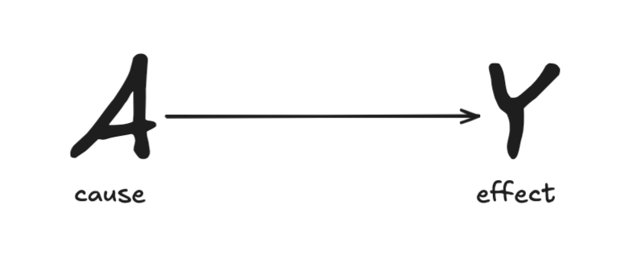
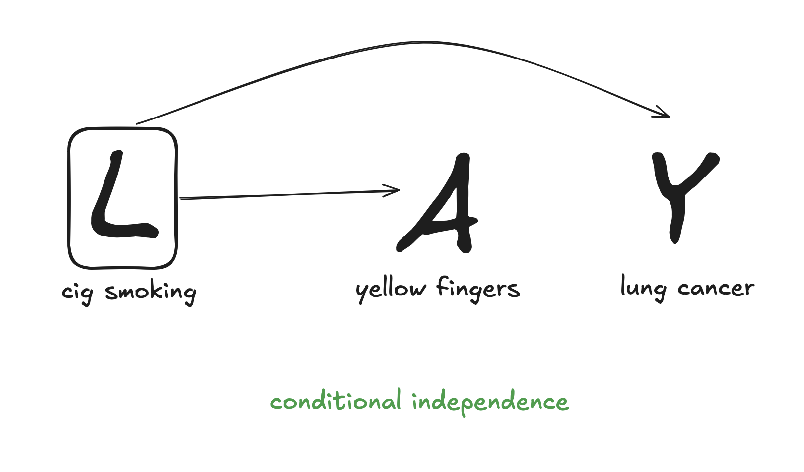
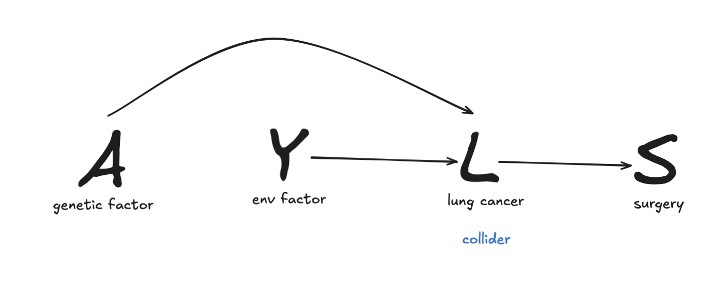
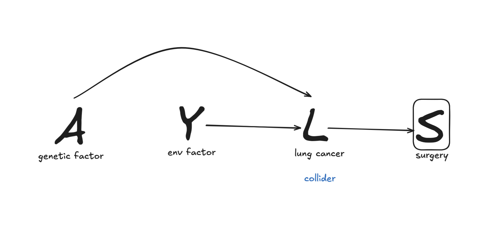

### competing questions
- does estrogen use lead to endometrial cancer
- does estrogen use speed up the rate of endometrial cancer diagnosis
### chain
- DAG: directed acrylic graphs. a DAG is about how the world works
- example of a hypothesis about reality:

- association: suppose we can collect the data below:

| lead ninja | heatwaves |
|------------|------------|
| yes        | yes        |
| no         | no         |      

DAGs could produce the same data => DAG is both a causal and statistical model
- arrow =/= deterministic
- no arrow = no causal relationship, though there might still be associations
- interventions follow arrow path => banning all lead ninjas from wearing bikinis to work tmr won't stop climate change
### fork: common causes
- systenmatic bias: any association between A and Y not due to the effect of A on Y
- common causes create an association
- conditional independence:

- listing down all mediators (B, C, etc) is unnecessary when you're trying to to estimate total causal effects of variable A on variable Y
### collider: conditioning on common effects
- common effects don't create an association, but can create an inverse association => selection bias
- common effects without condition:
- common effects with condition: 
  - either A or Y can be an indirect cause of S

