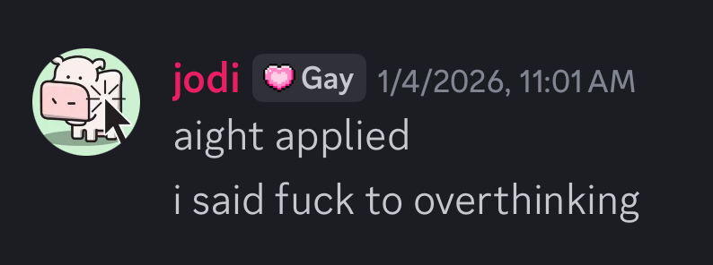

### Kênh Vĩnh Tế - 31/5/2026
People sitting on a two-hour coach from Kiên Giang to An Giang, bored out of their mind and empty stomach and sore bum, throwing out mấy câu hỏi ngây thơ như kiểu "Tại sao cần xuất khẩu?", "Tại sao không chỉ sản xuất đủ cho mình dùng/đúng nhu cầu người ta cần mua từ mình.", "Make cộng đồng tự cung tự cấp great again!", or "Tại sao CP lại không can thiệp vào nền kinh tế (thị trường) nhiều hơn?"

I was pretty annoyed because these are questions you'd explore in your standard econ 101 class. But wait, get off your high horse, econ is not a mandatory subject in school, so instead of being frustrated at their rudimentary take on the (macro) economy, I should be baffled at the reason why the public's perception of econ is like that in the first place. When did I realize that I'd been unfair? Field trip sông Thu Bồn.

### Sông Thu Bồn - 29/6/2026

### Sông Sài Gòn - 18/7/2026
Feels like I've been putting too much pressure on myself, on whether I can write something proper about each trip. How each one's shifted my perceptions. But today I'm saying fuck it, which was exactly how my 2026 started, with a volunteering application to the art fest hosted by the Goethe Institute in January (which will be soon referenced again at [cooking](../../cooking/init.md#oyster-sauce), perhaps next week):

This will be a fast one for now. 

I was having relatively low expectations for this one. Kiểu cuối tháng Năm đi sông Cái Bé (yes the title for each section is not technically correct, it's more like if I could name the trip bằng một địa danh đáng nhớ thì tui sẽ chọn cái nào hơn), cuối tháng Sáu đi ghe dọc sông Thu Bồn, đều là những nơi gần với tự nhiên hoang sơ bản địa hơn, văn hoá làng xóm cộng đồng khăng khít hơn, nên không nghĩ một chuyến đi trên một dòng sông ở một thành phố như Sài Gòn sẽ có gì đặc biệt. 

It turned out to be the most transformative experience out of the three so far. I hate to rank things, but it is what it is. Lowkey infatuated with Thảo Điền specifically at the moment because IT IS THE ART CAPITAL OF SÀI GÒN!

Hy vọng có thể quay lại Bình Quới thêm một, hai lần trước tháng Mười.

### [Tentative] Hà Tiên - 26/7/2026
Had an energy dip after a full-day trip to sông Sài Gòn yesterday. Not sure I can go on another trip soon. But as soon as the host* started mentioning Tao Đàn Chiêu Anh Các I was fucking done.

----
### footnotes
*Just feeling like leaving a footnote here, nothing important