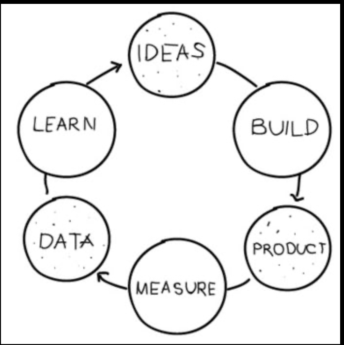

- is about tracking the right metric
- how to find the right metric? depending on at least 2 things:
	- the domain
	- stage of innovation you're in
- cycle: build => measure => learn
- stage of innovation
	- finding the problem
	- product-market fit
	- expand distribution
	- optimize revenue
	- growth (how is this different from optimizing revenue?)
- steps:
	- wut's your type of biz?
	- where's your biz at?
	- track the north star (one true metric) and optimize it
	- rinse and repeat
- lean: minimize waste

